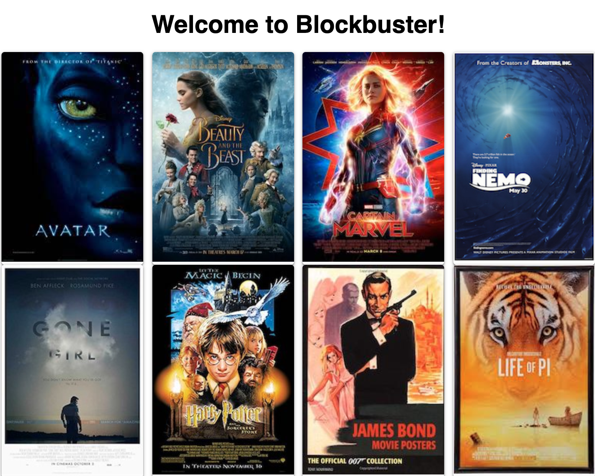
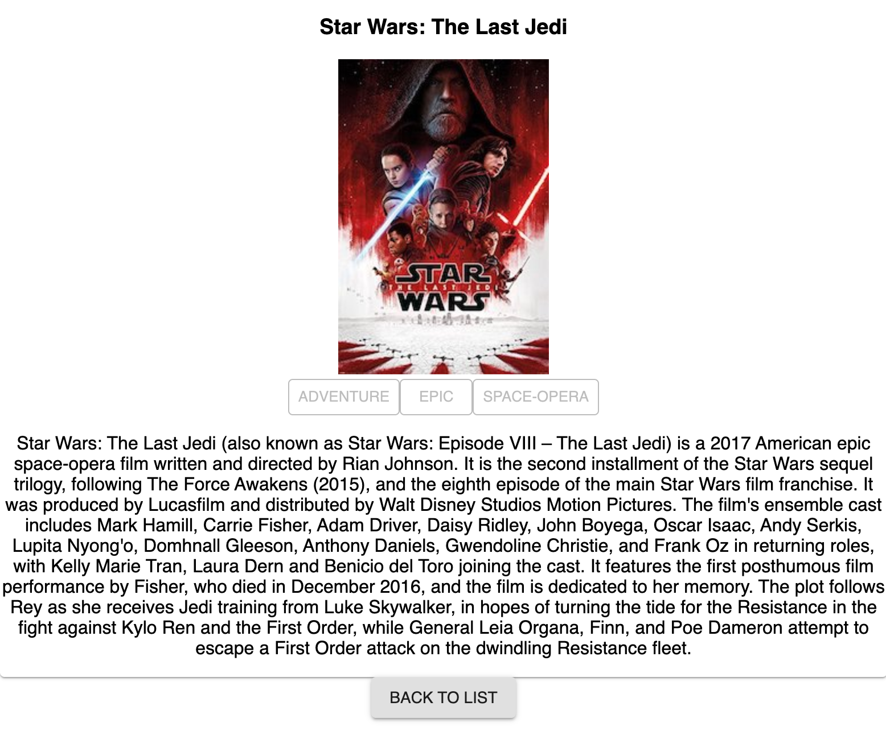

# Movie Gallery - Sagas
## Description

Reminiscent of walking into a Blockbuster in the 90s, this app opens up to a "shelf" full of hit movie posters.  We wanted to make it easy for our users to be able to see movies and access details about those movies.  Users can select a movie they want to see more details on, and it routes them directly to a Details page for that movie.  Navigation buttons allow users to move between movies and back to the list with ease.  Unlike Blockbuster, you can even add new movies to the list.

Future iterations of this application could include an Edit mode that lets users edit film descriptions or genres. Better searching and filtering could also be added as this app grows to meet the needs of its users.

## Setup

Create your database and name it "saga_movies_weekend". Add tables using the provided `data.sql` file. Start the server.

```
npm install
npm run server
```

Now that the server is running, open a new terminal tab with `cmd + t` and start the react client app.

```
npm run client
```

## Usage

Using this app is very intuitive, but after loading the main page you can navigate to any of the movies details by clicking on the movie poster.  There is also a button at the bottom of the page that will take you to a form to add new movies to the database.  From the details page, there's a handy back button to go back to the movie list.

## Screen Shots





## Built With

- Javascript
- React.js/Redux/Sagas
- node.js
- express
- PostgreSQL
- Material UI

## Acknowledgement

Thanks to all the cool beans in the Rabin cohort at Prime! Even the garbanzos.

## Developer's Notes

Mad respect to the Material-UI mavens of the world.  Building a nice looking webpage is tough!

## Support

If you have issues or suggestions, please email me at [dewitt.kane@gmail.com].